# Integrais envolvendo Seno e Cosseno

### a) ∫ sen x dx
### b) ∫ cos x dx
### c) ∫ sen x * cos x dx
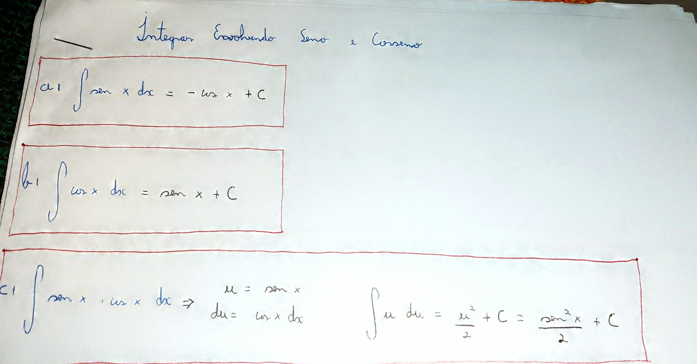 

---
### d) ∫ sen²x dx
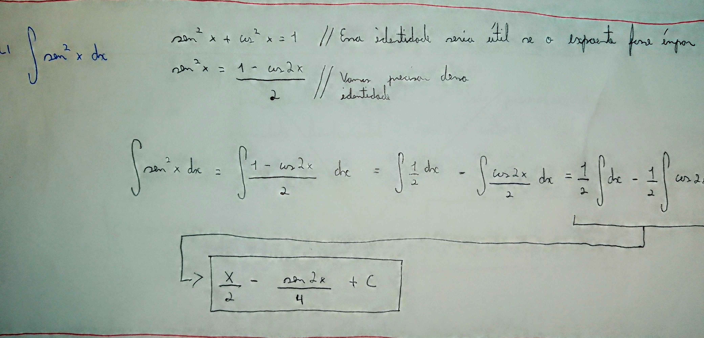 

---
### e) ∫ cos²x dx
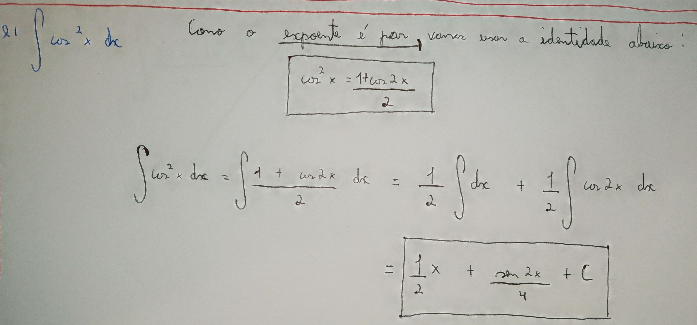 

---
### f) ∫ sen²x * cos x dx
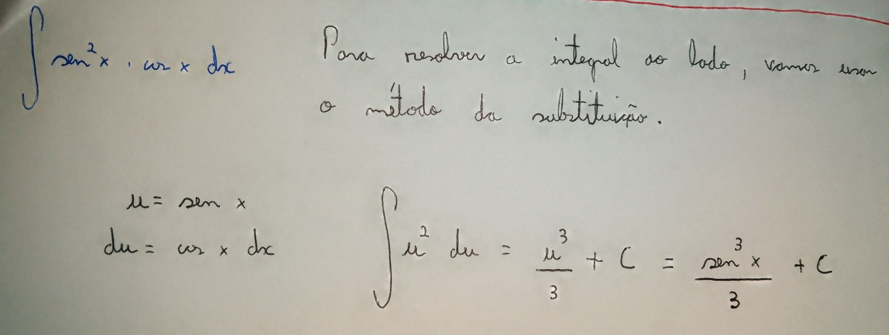 

---
### g) ∫ sen x * cos²x dx
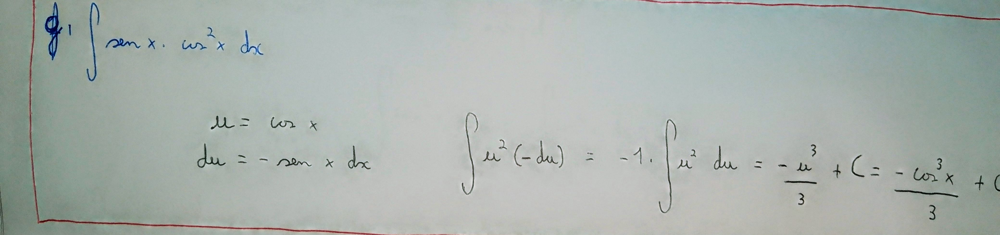 

---
### h) ∫ sen²x * cos²x dx
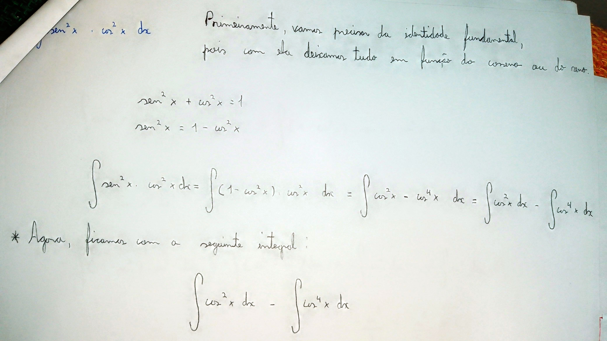 
 
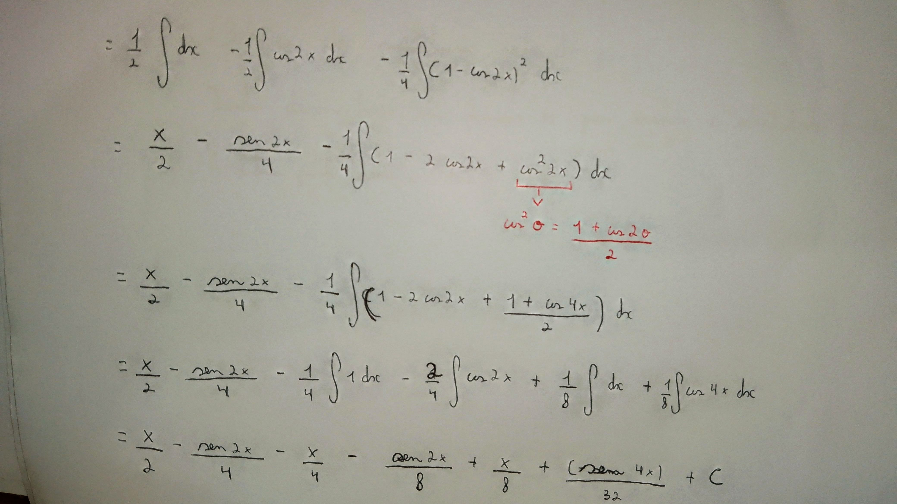 

---
### i) ∫ sen³x * cos²x dx
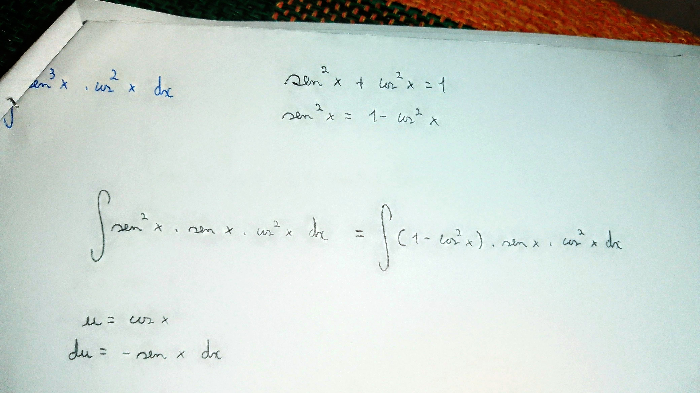 
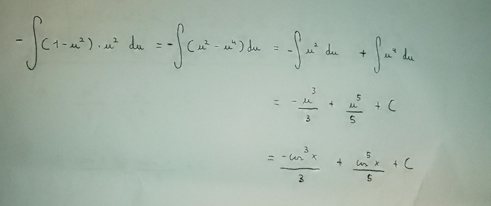 
 

---
### j) ∫ sen³x * cos³x dx
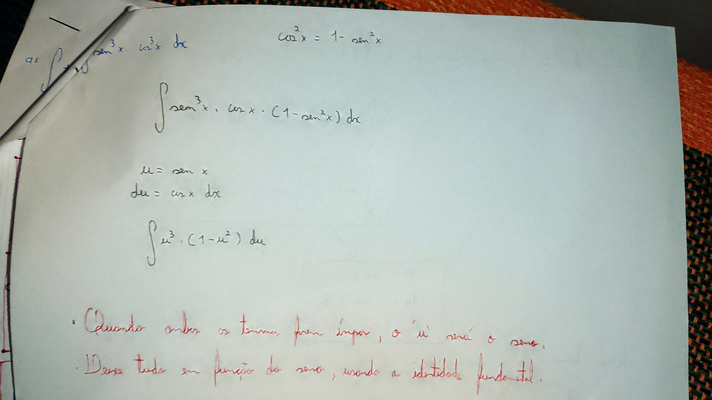 

---
### Integral com tangente e secante

### a) ∫ tg⁴x dx
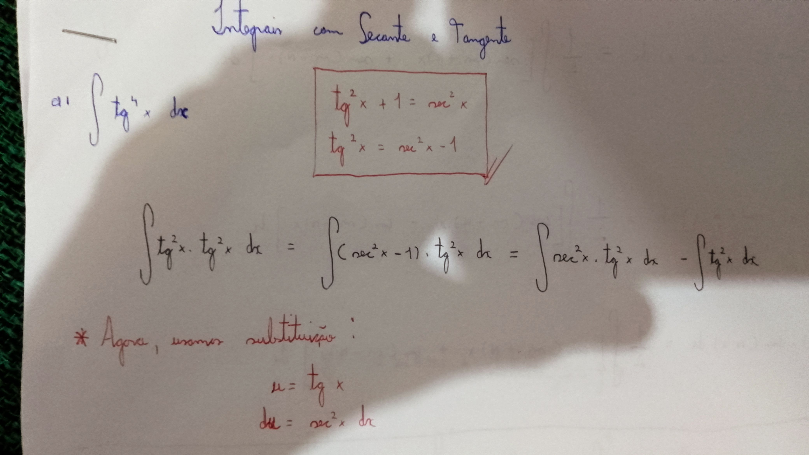 
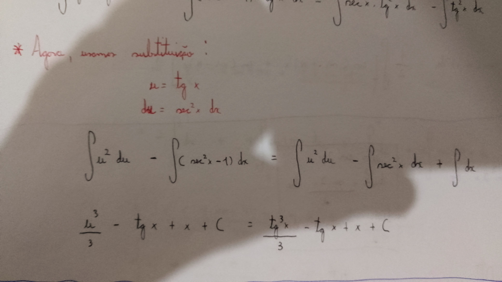 

---
### b) ∫ sec³x dx
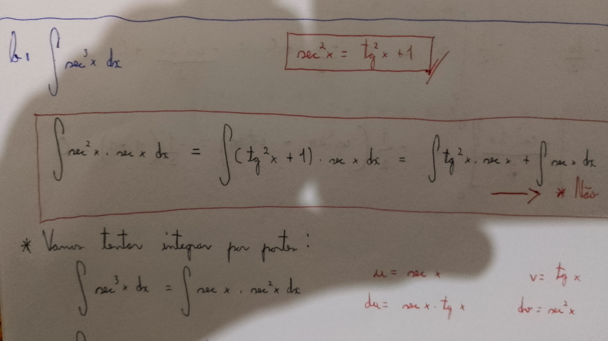 
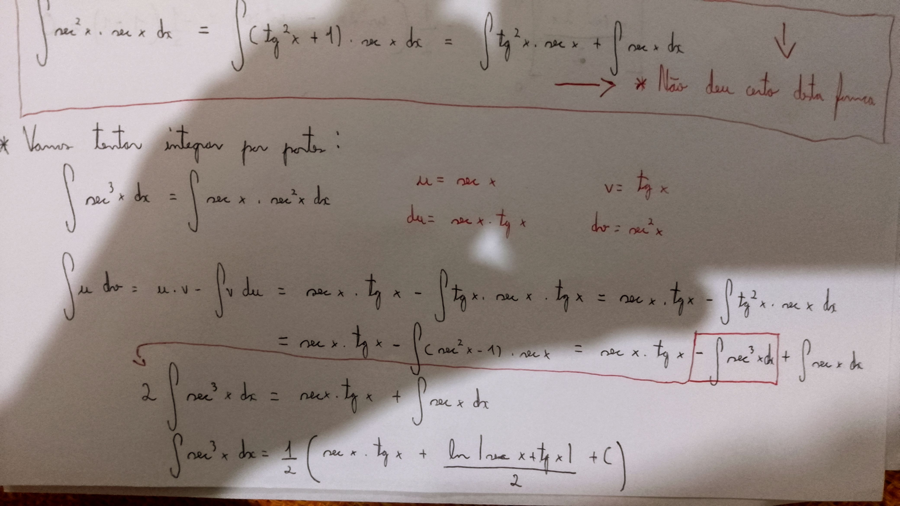 

---
### Outras fórmulas importantes
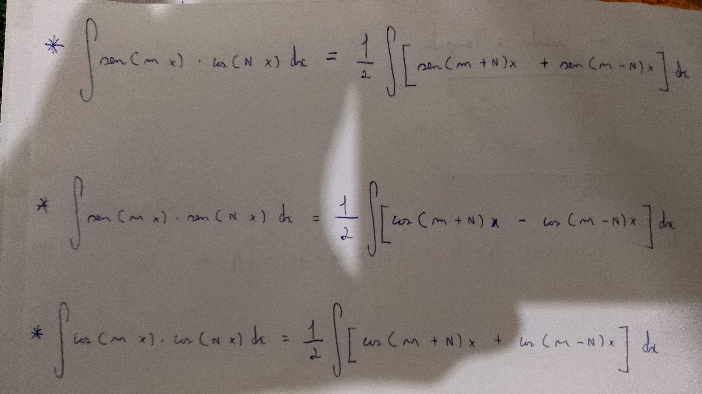
