# Resolução parcial da Lista 01

### 1º a)
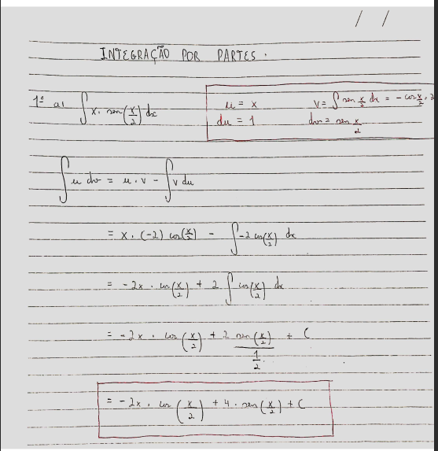 

---
### 1º b)
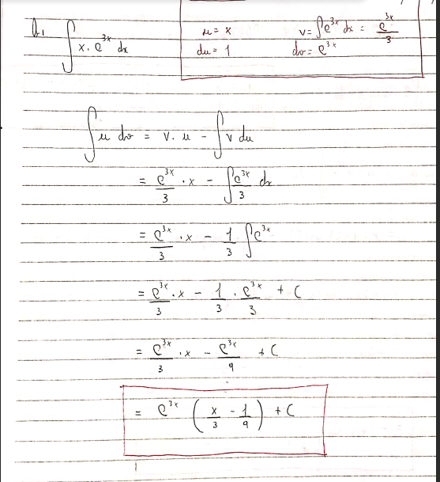 

---
### 1º c)
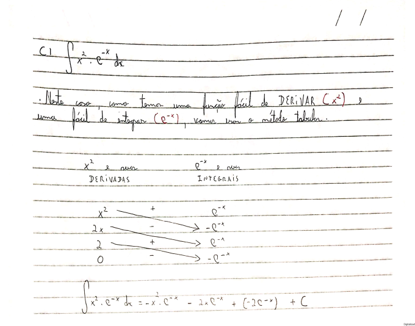 

---
### 1º d) 
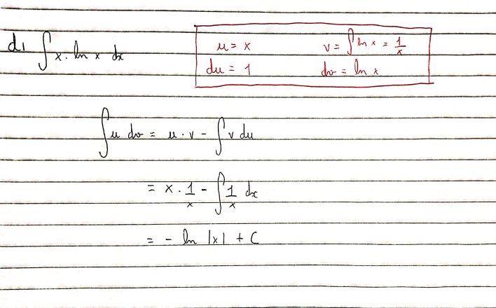 

---
### 1º e)
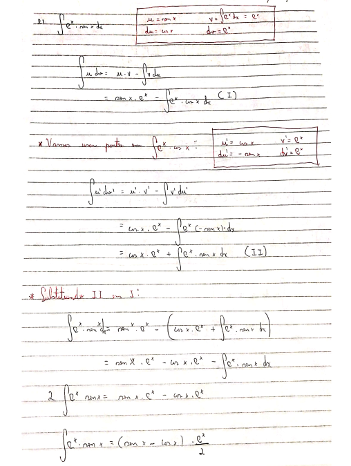 

---
### 1º f)
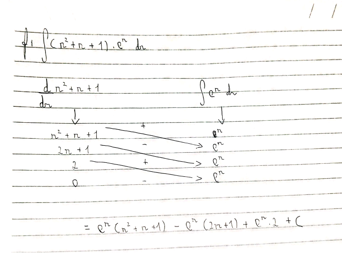 

---
### 2ª a)
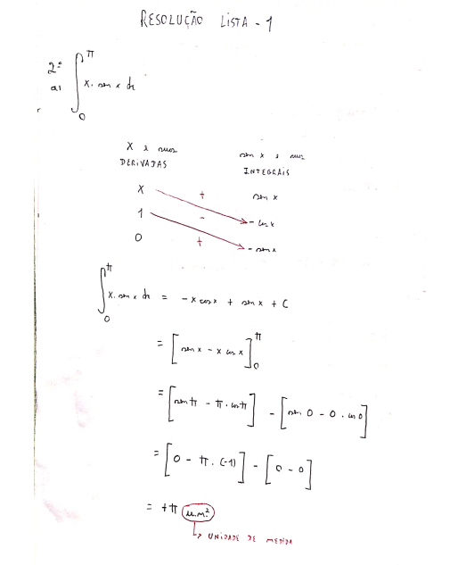 

---
### 2ª b) e c)
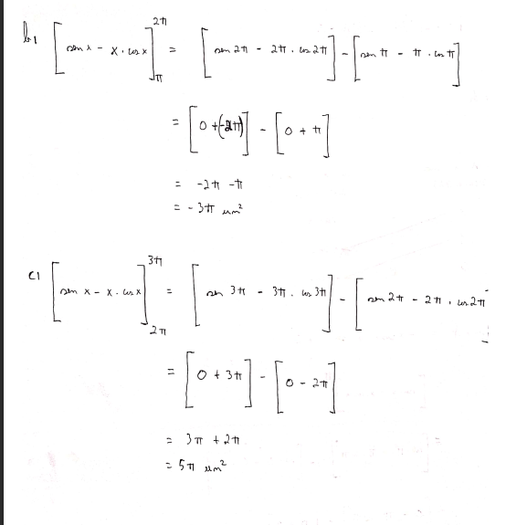 

---
### 4ª a), b) e c)
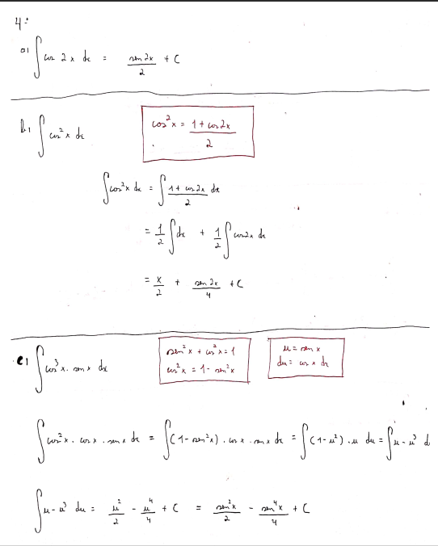 

---
### 4ª d), e), f)
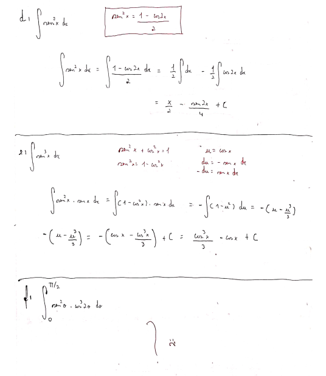 

---
### 5ª a), b), c)
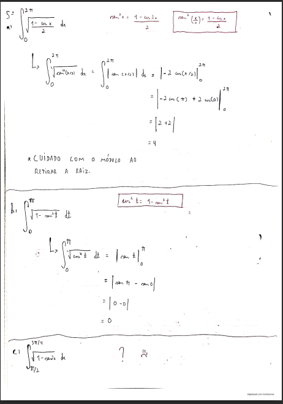 

---
### 6ª a)
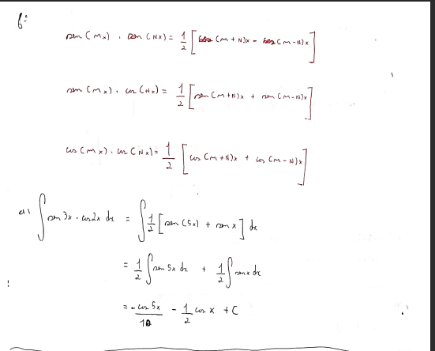 

---
### 6ª b)
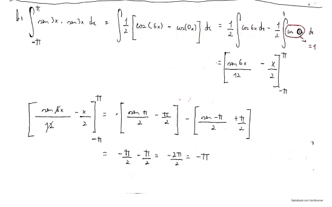 

---
### 6ª c)
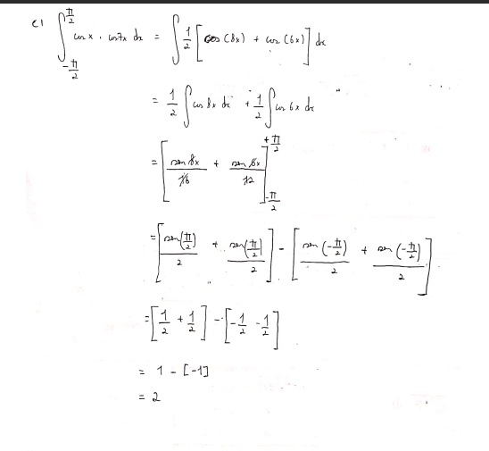 

---
### 7ª a)
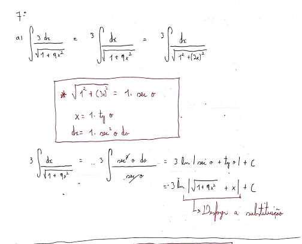 

---
### 7ª b)
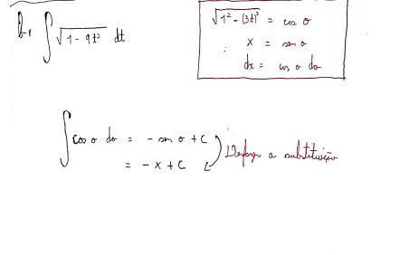 

---
### 7ª c)
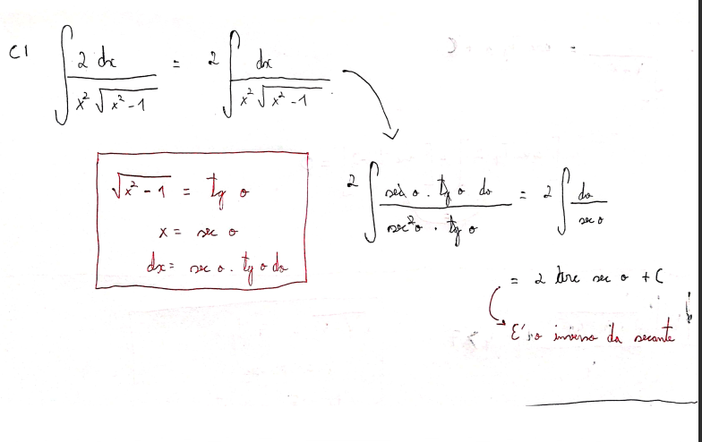

